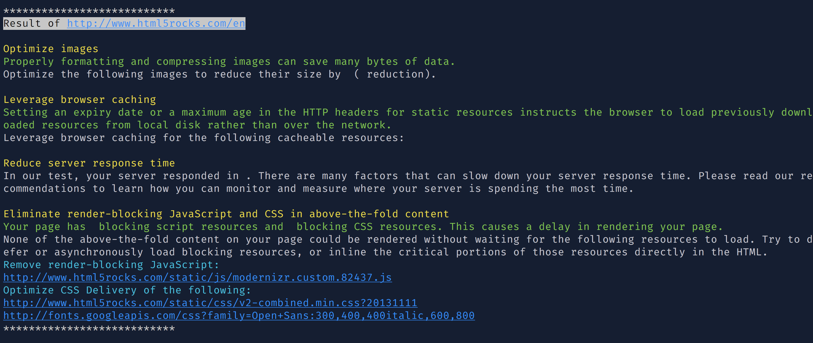

# auto-psi
-

> Auto run PageSpeed insight with configuration

## Usage

1. clone this repository and `npm install`

1. Setup pages what you want to scan with PageSpeed insight in `pages.js`

  For example:
  ```js
  module.exports = [{
    domain: 'http://www.html5rocks.com/',
    addresses: ['en', 'ja', 'ko'],
    strategy: 'desktop',
    rules: [
      'Optimize images',
      'Leverage browser caching',
      'Reduce server response time',
      'Eliminate render-blocking JavaScript and CSS in above-the-fold content'
    ]
  }];

  ```

1. Run `auto_psi` with `node index.js` and it should show messages like below.



## Configuration

> You should setup pages you'd like to scan with psi in `pages.js`.
> It will be an array of objects and format of each object should follow below

### domain

Type: `string`

URL of the page you'd like to scan with psi.

### addresses

**Optional**

Type: `array`

If you want to scan with multiple pages with same domain, you can use addresses here instead of writing multiple objects.

```js
addresses: ['en', 'ja', 'ko']
```

### rules

Type: `array`

Rules which you want to know the results.

```js
rules: [
  'Optimize images',
  'Leverage browser caching',
  'Reduce server response time',
  'Eliminate render-blocking JavaScript and CSS in above-the-fold content'
]
```

### strategy (Same as `psi` API)

Type: `string`<br/>
Default: `mobile`<br/>
Values: `mobile`, `desktop`<br/>

Strategy to use when analyzing the page.

## Dependencies

- [psi](https://github.com/addyosmani/psi): PageSpeed Insights with reporting

## License

MIT
